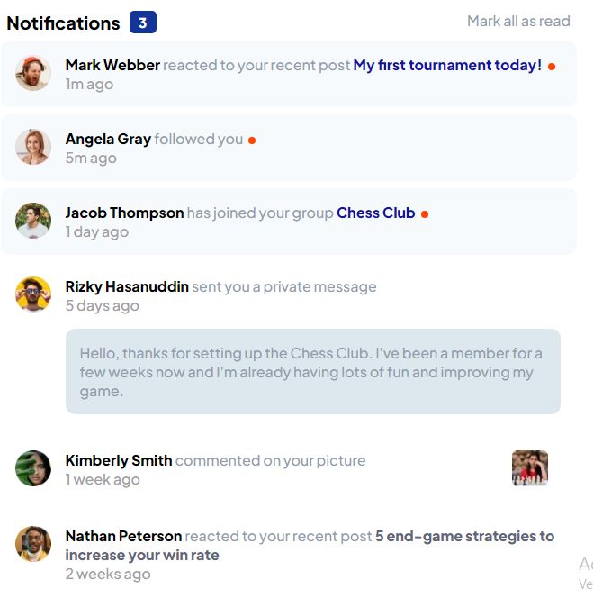

This a solution to the Notifications Page Main challenge on Frontend Mentor

OVERVIEW

***Screenshot***



***Links***

Solution URL [](https://notifications-page-main-mak2220.netlify.app/)

***Built with***

-Semantic HTML5 markup
-SCSS custom properties
-Vanila JavaScript and JQuary
-Mobile-first worflow

WHAT I LEARNED

In this project use the SCSS properties and the JQuery library and improve my handling of those tools. I'm proud of all my code

```JQuary

function activedStates(){
    read.addEventListener('click',function(){
        for (let i = 0; i<= active.length; i++) {
            $('.active').removeClass('active');
            $('.circle').remove();
            $('#notif').remove();        
        }
    })
    for(let i=0; i<active.length; i++){
            active[i].addEventListener('click',function(){ 
                this.classList.remove('active');
        })
    };
    for(let i=0; i<comentario.length; i++){
        comentario[i].addEventListener("click",function(){
            this.classList.replace('whioutReading','comentario')
        })
    };
    for(let i=0; i<message.length; i++){
        message[i].addEventListener("click",function(){
            this.classList.replace('message','reading')
        })
    };
}
´´´

CONTINUED DEVELOPMENT

I want to continue deepening the realization of all kinds of frontend projects

AUTHOR

-Website- [Marcos Berta] (https://www.linkedin.com/in/marcos-berta-60a220225)
-Frontend Mentor -[mak2220](https://www.frontendmentor.io/profile/mak2220)
